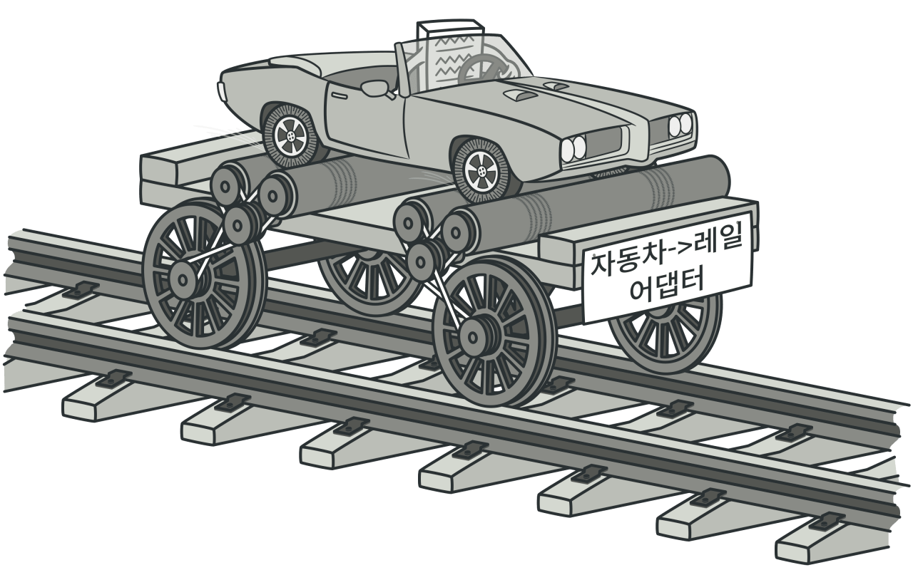
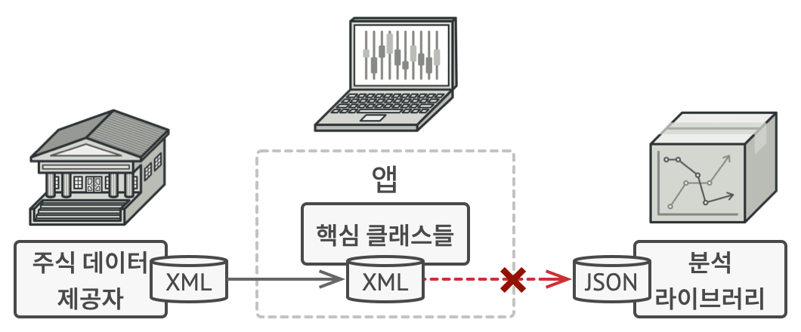
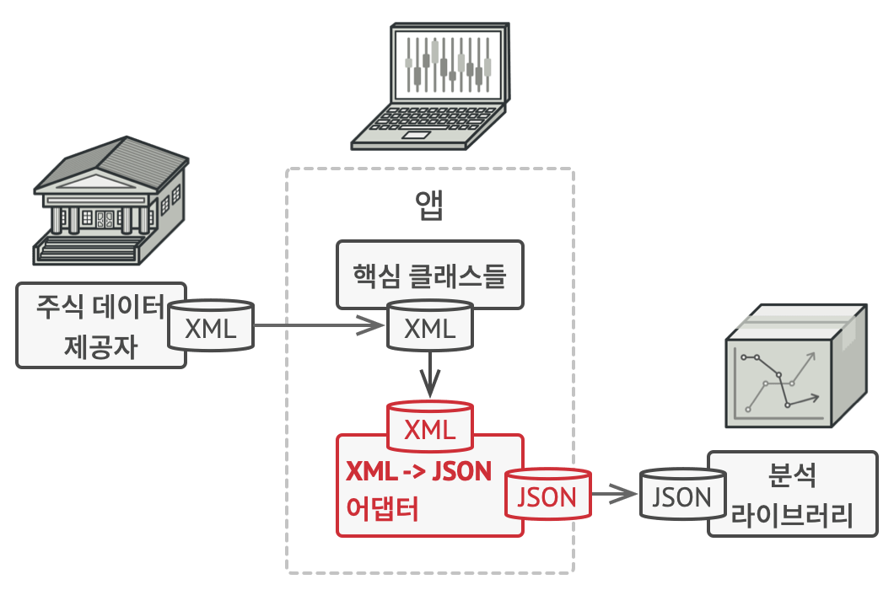

# 어댑터 패턴
#### A.K.A Wrapper, Adapter

---
### 도입 의도
- 호환성이 없는 인터페이스를 함께 사용해야 할 때 사용

### 문제

- 해외여행
    - 해외 여행을 가면 한국의 220V 전기 콘센트를 사용할 수 없는 경우가 있음.
      - 이럴 때, 새 충전기를 구매하는 대신 한국의 콘센트를 사용할 수 있게 할 수 없을까?
      - 해결책: 어댑터를 사용한다.

- 데이터 변환
  - JSON 형태로만 데이터를 다룰 수 있는 라이브러리가 있음
  - 그런데, 데이터는 모두 XML 형태로만 제공됨
  - JSON 라이브러리를 사용하려면 XML 데이터를 JSON 데이터로 변환해야 함
- 실제 예) umon-service-communicator? <- 이 부분은 확인 후 수정...

### 해결 방안

- XML 데이터를 JSON 데이터로 변환하는 어댑터를 만들어서 제공된 데이터를 JSON 라이브러리에서 사용할 수 있게 한다.

### 적용을 고려할 상황
- 기존 클래스를 사용하고 싶지만 그 인터페이스와 나머지 코드가 호환되지 않을 때
  - 호환되지 않는 인터페이스가 있는 클래스가 최소 두 개 이상 있는지 확인
    - 변경하기 힘들거나 변경할 수 없는 서비스 클래스가 있음
      - 타사 코드
      - 레거시 코드
      - 기존 의존성이 많은 코드
      - ...
    - 해당 서비스 클래스를 사용하여 이득을 얻을 수 있는 하나 혹은 여러 개의 클라이언트 클래스가 있음
- 부모 클래스에 추가할 수 없는 어떤 공통 기능들이 없는 여러 기존 자식 클래스들을 재사용하려는 경우
  - 데코레이터 패턴과 유사한 접근방식

### 구현방법
- 클라이언트 - 서비스 구조로 클래스가 있다고 가정
  1. 클라이언트 인터페이스를 선언하고 클라이언트들이 서비스와 통신하는 방법을 기술
  2. 어뎁터 클래스를 생성한 후 클라이언트 인터페이스들이 이를 따르도록 함
  3. 서비스 객체에 참조를 저장하기 위해 어댑터 클래스에 필드를 추가
  4. 클라이언트 인터페이스의 모든 메서드를 어댑터 클래스에서 하나씩 구현
  5. 클라이언트 코드들이 인터페이스를 따라 어뎁터를 사용하므로 서비스 객체를 사용할 수 있게 됨

### 장단점
- 장점
  - 데이터를 변환하는 코드를 어댑터 클래스에 모아둠으로써 단일 책임 원칙을 준수하고 코드의 가독성을 높일 수 있음
  - 클라이언트 코드가 인터페이스를 통해 서비스와 통신하므로 개방/폐쇄 원칙을 준수하고 유연성을 높일 수 있음
- 단점
  - 다수의 새로운 인터페이스와 클래스를 도입해야 하여 코드가 복잡해질 수 있음
  - 때로는 서비스 클래스가 변경 가능하다면 서비스 클래스를 변경하는 것이 더 간단할 수 있음

### 다른 패턴들과의 관계
- 브리지
  - 브리지 패턴은 사전에 설계됨. 반면 어댑터는 이미 존재하는 코드에 호환되지 않는 새 클래스를 추가할 때 사용
- 데코레이터
  - 데코레이터는 해당 객체의 인터페이스를 변경하지 않음. 반면 어댑터는 기존 객체의 인터페이스를 변경함.
- 퍼사드
  - 퍼사드는 기존 객체들을 위한 새 인터페이스를 정의함. 반면 어댑터는 기존 객체의 인터페이스를 사용할 수 있게 하려 노력함.