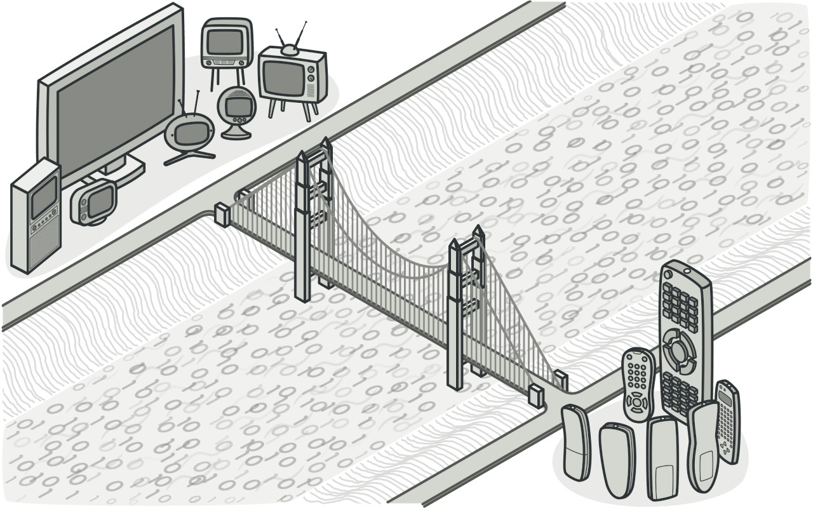
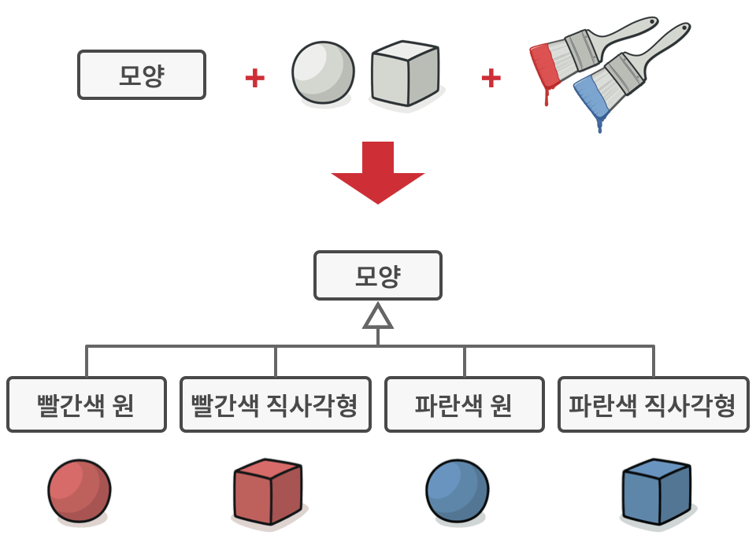

# 브리지 패턴
#### A.K.A Bridge

---
### 도입 의도
- 큰 클래스 또는 밀접하게 관련된 클래스들의 집합을 두 개의 개별 계층구조로 나눈 뒤 각각 독립적으로 확장할 수 있도록 한다.


### 문제
- ```Shape```라는 추상 클래스가 있고, ```Circle```, ```Square```, ```Rectangle``` 등의 구현 클래스가 있다고 가정하자.
- 이때 ```RedCircle```, ```GreenCircle```, ```BlueCircle``` 등의 자식 클래스를 추가하고 싶다면?
- 각각의 구현 클래스에 대해 ```RedSquare```, ```GreenSquare```, ```BlueSquare``` 등의 자식 클래스를 모두 추가한다면 너무나도 많은 클래스가 생성된다.

- ```Shape```, ```Color``` 클래스의 예시가 적절치 않다고 생각된다면 ```Notification``` 클래스와 ```Sender``` 클래스의 예시를 살펴보자,
  - 긴급 이메일, 긴급 푸시, 긴급 문자 메시지 등을 보내는 클래스를 만들고 싶다면?
  - 거기에 더해서 긴급하진 않지만 경고를 보내는 경고 이메일, 경고 푸시, 경고 문자 메시지 등을 보내는 클래스를 만들고 싶다면?
  - 이렇게 되면 너무 많은 클래스가 생성된다.

### 해결 방안
- ```Shape``` 클래스와 ```Color``` 클래스를 분리한다.
  - 상속에서 객체 합성으로 전환하여 문제 해결을 시도.
- ```Notification``` 클래스와 ```Sender``` 클래스를 분리한다.
  - 알림을 보내는 클래스와 알림의 종류를 나타내는 클래스를 분리하여 문제 해결을 시도.
  - 실제로 알림을 보낼 땐 두 객체를 합성하여 문제를 해결한다.

### 구현방법
1. 직교하는 클래스가 있는지 클래스들을 살펴본다
   - 추상화/플랫폼
   - 도메인/인프라
   - 프론트엔드/백엔드
   - 인터페이스/구현
   - ...
2. 클라이언트가 필요로 하는 작업들을 확인한 후 기초 추상 클래스에서 정의
3. 모든 플랫폼들에 제공되어야 하는 작업들을 결정하고 추상화에 필요한 작업을 일반 구현 인터페이스에서 선언
4. 도메인의 모든 플랫폼에 대해 구상 구현 클래스들을 생성하되 이 클래스들 모두가 구현 인터페이스를 따르도록 하기
5. 추상화 클래스 내에서 구현 유형에 대한 참조 필드를 추가
   - 추상화는 대부분의 작업을 구현 객체에 위임
6. 상위 수준 논리의 변형들이 여러 개 있는 경우 기초 추상화 클래스를 확장하여 각 변형에 대해 정제된 추상화들을 만듦
7. 클라이언트 코드는 구현 객체를 추상화의 생성자에 전달. 이제 클라이언트는 추상화 객체와 작업할 수 있ㄷ다.

### 장단점
- 장점
  - 플랫폼 독립적인 클래스들과 앱들을 만들 수 있다.
  - 클라이언트 코드가 추상화를 통해 작동하므로 플랫폼의 세부 구현이 노출되지 않는다.
  - 새로운 추상화와 구현을 상호 독립적으로 도입할 수 있어 개방/폐쇄 원칙을 준수한다.
  - 추상화와 구현이 명확히 분리되어 각자의 책임을 정의하므로 단일 책임 원칙을 준수한다.
- 단점
  - 결합도가 높은 클래스에 패턴을 적용하여 코드를 더 복잡하게 만들 수 있다.

### 다른 패턴들과의 관계
- 어댑터
  - 브리지 패턴은 사전에 설계됨. 반면 어댑터는 이미 존재하는 코드에 호환되지 않는 새 클래스를 추가할 때 사용
- 추상 팩토리, 빌더
  - 브리지 패턴과 함께 사용할 수 있다.
  - 추상화가 특정 구현과 함께할 때만 작동할 수 있을 때 추상 팩토리 패턴을 함께 사용하면 복잡한 세부 구현을 클라이언트 코드로부터 숨길 수 있다.