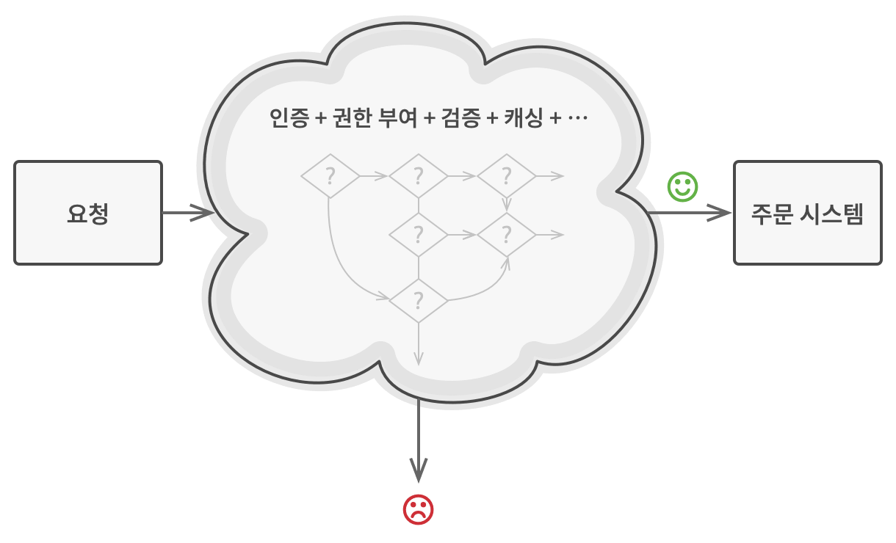
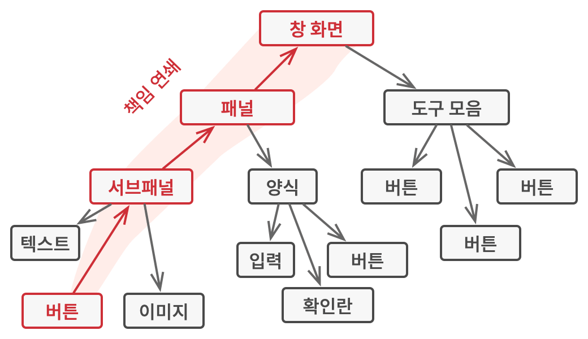

# 책임 연쇄 패턴
#### A.K.A CoR、커맨드 사슬、Chain of Responsibility

---
### 도입 의도
- 핸들러들의 체인(사슬)을 따라 요청을 전달할 수 있게 해주는 행동 디자인 패턴
  - 각 핸들러는 요청을 받으면 요청을 처리할지 아니면 체인의 다음 핸들러로 전달할지를 결정

### 문제

- 온라인 주문 시스템을 개발하고 있다고 가정
  - 인증된 사용자들만 주문을 생성할 수 있도록 시스템에 대한 접근을 제한하려고 함
  - 또한, 관리 권한이 있는 사용자들에게는 모든 주문에 대한 전체 접근 권한을 부여하려고 함
- 이러한 이러한 검사들은 차례대로 수행해야 한다
  - 그런데 여기에 새로운 검사들이 추가된다면?
    - 요청 내의 데이터를 정제(sanitize)하는 추가 유효성 검사
    - 같은 IP 주소에서 오는 반복적으로 실패한 요청을 걸러내는 검사
    - 적절한 캐시 응답이 없는 경우에만 요청이 시스템으로 전달되도록 하는 또 다른 검사
    - ...
  - 검사 코드가 너무 많고 복잡해진다!

### 해결 방안

- 특정 행동들을 핸들러라는 독립 실행형 객체들로 변환
- 핸들러들을 체인으로 연결
  - 연결된 각 핸들러에는 체인의 다음 핸들러에 대한 참조를 저장하기 위한 필드가 존재
  - 요청을 처리하는 것 외에도 핸들러들은 체인을 따라 요청을 더 멀리 전달
  - 요청은 모든 핸들러가 요청을 처리할 기회를 가질 때까지 체인을 따라 이동

### 구현방법
1. 핸들러 인터페이스를 선언하고 요청을 처리하는 메서드의 시그니처를 설명
   - 클라이언트가 요청 데이터를 메서드에 전달하는 방법을 결정
   - 가장 유연한 방법은 요청을 객체로 변환하여 처리 메서드에 인수로 전달하는 것
2. 구상 핸들러들에서 중복된 상용구 코드를 제거하려면 핸들러 인터페이스에서 파생된 추상 기초 핸들러 클래스를 만드는 것도 고려할만함
   - 핸들러 클래스에는 체인의 다음 핸들러에 대한 참조를 저장하기 위한 필드가 필요
   - 핸들링 메서드를 위한 편리한 디폴트 행동을 구현할 수 있음
3. 구상 핸들러 자식 클래스들을 만들고 그들의 처리 메서드들을 구현
   - 요청을 처리할지의 여부
   - 체인을 따라 요청을 전달할지의 여부
   - 각 핸들러는 요청을 받았을 때 이상의 2가지 결정을 내려야 함
4. 클라이언트는 자체적으로 체인을 조립하거나 다른 객체들에서부터 미리 구축된 체인을 받음
5. 클라이언트는 첫 번째 핸들러뿐만 아니라 체인의 모든 핸들러를 활성화할 수 있음
   - 요청은 어떤 핸들러가 더 이상의 전달을 거부하거나 요청이 체인 끝에 도달할 때까지 체인을 따라 전달
6. 체인의 동적 특성으로 인해 클라이언트는 다음 상황들을 처리할 준비가 되어 있어야 함
   - 체인은 단일 링크로 구성될 수 있음
   - 일부 요청들은 체인 끝에 도달하지 못할 수 있음
   - 다른 요청들은 처리되지 않은 상태로 체인의 끝에 도달할 수 있음

### 장단점
- 장점
  - 요청의 처리 순서를 제어할 수 있다
  - 당신은 작업을 호출하는 클래스들을 작업을 수행하는 클래스들과 분리하여 단일 책임 원칙을 준수
  - 기존 클라이언트 코드를 손상하지 않고 앱에 새 핸들러들을 도입할 수 있어 개방 폐쇄 원칙을 준수
- 단점
  - 일부 요청들은 처리되지 않을 수 있다

### 다른 패턴들과의 관계
- 커맨드, 중재자, 옵서버 및 책임 연쇄 패턴
  - 책임 연쇄 패턴은 잠재적 수신자의 동적 체인을 따라 수신자 중 하나에 의해 요청이 처리될 때까지 요청을 순차적으로 전달
  - 커맨드 패턴은 발신자와 수신자 간의 단방향 연결을 설립
  - 중재자 패턴은 발신자와 수신자 간의 직접 연결을 제거하여 그들이 중재자 객체를 통해 간접적으로 통신하도록 강제
  - 옵서버 패턴은 수신자들이 요청들의 수신을 동적으로 구독 및 구독 취소할 수 있도록 함
- 복합체 패턴
  - 책임 연쇄 패턴은 종종 복합체 패턴과 함께 사용
  - 잎 컴포넌트가 요청을 받으면 해당 요청을 모든 부모 컴포넌트들의 체인을 통해 객체 트리의 뿌리까지 전달 (상단의 이미지 참고)
- 커맨드 패턴
  - 책임 연쇄 패턴의 핸들러들은 커맨드로 구현할 수 있다
  - 많은 다양한 작업을 같은 콘텍스트 객체에 대해 실행할 수 있으며, 해당 콘텍스트 객체는 요청의 역할을 함
    - 여기에서의 요청은 처리 메서드의 매개변수를 의미
  - 요청 자체가 커맨드 객체인 다른 접근 방식도 존재
    - 이 접근 방식을 사용하면 같은 작업을 체인에 연결된 일련의 서로 다른 콘텍스트들에서 실행할 수 있음
- 데코레이터 패턴
  - 책임 연쇄 패턴과 데코레이터는 클래스 구조가 매우 유사
    - 두 패턴 모두 실행을 일련의 객체들을 통해 전달할 때 재귀적인 합성
    - 그러나, 책임 연쇄 패턴 핸들러들은 서로 독립적으로 임의의 작업을 실행할 수 있으며, 또한 해당 요청을 언제든지 더 이상 전달하지 않을 수 있음
    - 반면에 다양한 데코레이터들은 객체의 행동을 확장하며 동시에 이러한 행동을 기초 인터페이스와 일관되게 유지할 수 있으며 데코레이터들은 요청의 흐름을 중단할 수 없다