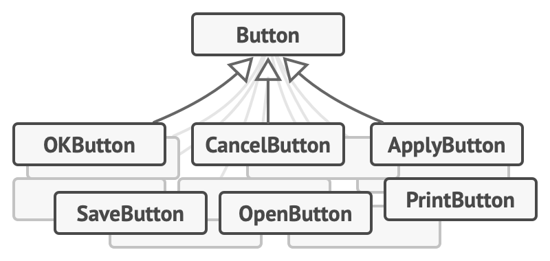
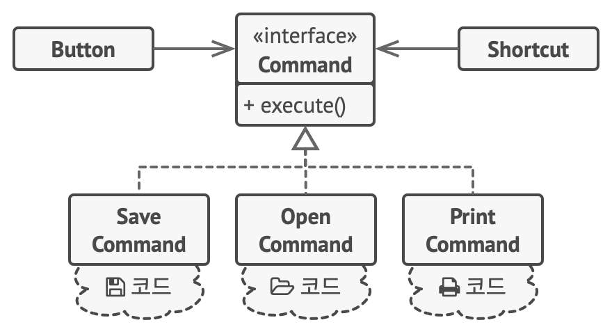

# 커맨드 패턴
#### 액션, 트랜잭션, Command

---
### 도입 의도
- 요청에 대한 모든 정보가 포함된 독립실행형 객체로 변환
    - 다양한 요청들이 있는 메서드들을 인수화 할 수 있도록 함
    - 요청의 실행을 지연 또는 대기열에 넣을 수 있도록 하고, 또 실행 취소할 수 있는 작업을 지원

### 문제

- 텍스트 편집기 앱을 개발하고 있다고 상상
  - 편집기의 다양한 작업을 위한 여러 버튼이 있는 도구 모음(툴바)을 만드는 중
    - 도구 모음의 버튼들과 다양한 대화 상자들의 일반 버튼들에 사용할 수 있는 매우 깔끔한 Button(버튼) 클래스를 만들었음
    - 버튼들은 모두 비슷해 보이지만 각각 다른 기능들을 수행
      - 그러면 이 버튼들의 다양한 클릭 핸들러들에 대한 코드는 어디에?
        - 버튼이 사용되는 각 위치에 수많은 자식 클래스를 만들기
          - 자식 클래스가 끔찍하게 많아짐
      - 다양한 버튼이 같은 기능을 수행한다면?

### 해결 방안

- 관심사 분리의 원칙을 기반으로 하는 커맨드 패턴을 사용
  - 모든 요청 세부 정보들을 요청을 작동시키는 단일 메서드를 가진 별도의 커맨드 클래스로 추출
    - 커맨드 객체들은 다양한 그래픽 사용자 인터페이스 객체들과 비즈니스 논리 객체들 간의 링크 역할
    - 그래픽 사용자 인터페이스 객체는 어떤 비즈니스 논리 객체가 요청을 받을지와 이 요청이 어떻게 처리할지에 대하여 알 필요가 없음
  - 커맨드들이 같은 인터페이스를 구현하도록 함
    - 이 인터페이스는 다양한 커맨드들을 커맨드들의 구상 클래스들과 결합하지 않고 같은 요청 발신자와 사용할 수 있게 해
    - 이제 발신자에 연결된 커맨드 객체들을 전환할 수 있으며, 그렇게 하여 런타임에 발신자의 행동을 변경할 수 있음
  - 요청의 세부 정보는 커맨드를 이러한 데이터로 미리 설정해놓거나, 이 데이터를 자체적으로 가져올 수 있도록 해야 함
  - 커맨드들은 그래픽 사용자 인터페이스 레이어와 비즈니스 로직 레이어 간의 결합도를 줄이는 편리한 중간 레이어가 됨

### 구현방법
1. 단일 실행 메서드로 커맨드 인터페이스를 선언
2. 요청들을 커맨드 인터페이스를 구현하는 구상 커맨드 클래스들로 추출
   - 클래스에는 실제 수신자 객체에 대한 참조와 함께 요청 인수들을 저장하기 위한 필드들의 집합이 있어야 함
   - 이러한 모든 값은 커맨드의 생성자를 통해 초기화
3. 발송자 역할을 할 클래스들을 식별
   - 클래스들에 커맨드들을 저장하기 위한 필드들을 추가
   - 발송자들은 커맨드 인터페이스를 통해서만 커맨드들과 통신
   - 발송자들은 일반적으로 자체적으로 커맨드 객체들을 생성하지 않고 클라이언트 코드에서 가져와 사용
4. 수신자에게 직접 요청을 보내는 대신 커맨드를 실행하도록 발송자들을 변경
5. 클라이언트는 다음 순서로 객체들을 초기화
   - 수신자 생성
   - 커맨드들을 만들고 필요한 경우 수신자들과 연관시킴
   - 발송자들을 만들고 특정 커맨드들과 연관시킴

### 장단점
- 장점
  - 작업을 호출하는 클래스들을 이러한 작업을 수행하는 클래스들로부터 분리하여 단일 책임 원칙 준수
  - 기존 클라이언트 코드를 손상하지 않고 앱에 새 커맨드들을 도입할 수 있어 개방 폐쇄 원칙 준수
  - 실행 취소/다시 실행을 구현할 수 있음
  - 작업들의 지연된 실행을 구현할 수 있음
  - 간단한 커맨드들의 집합을 복잡한 커맨드로 조합할 수 있음
- 단점
  - 발송자와 수신자 사이에 완전히 새로운 레이어를 도입하기 때문에 코드가 더 복잡해질 수 있음

### 다른 패턴들과의 관계
- 커맨드, 중재자, 옵서버 및 책임 연쇄 패턴
  - 책임 연쇄 패턴은 잠재적 수신자의 동적 체인을 따라 수신자 중 하나에 의해 요청이 처리될 때까지 요청을 순차적으로 전달
  - 커맨드 패턴은 발신자와 수신자 간의 단방향 연결을 설립
  - 중재자 패턴은 발신자와 수신자 간의 직접 연결을 제거하여 그들이 중재자 객체를 통해 간접적으로 통신하도록 강제
  - 옵서버 패턴은 수신자들이 요청들의 수신을 동적으로 구독 및 구독 취소할 수 있도록 함
- 전략 패턴
  - 두 패턴은 비슷해 보일 수 있음
    - 둘 다 어떤 작업으로 객체를 매개변수화하는 데 사용할 수 있기 때문
    - 그러나 이 둘의 의도는 매우 다름
  - 커맨드를 사용하여 모든 작업을 객체로 변환할 수 있음
    - 작업의 매개변수들은 해당 객체의 필드들이 됨
    - 이 변환은 작업의 실행을 연기하고, 해당 작업을 대기열에 넣고, 커맨드들의 기록을 저장한 후 해당 커맨드들을 원격 서비스에 보내는 등의 작업을 가능하게 함
  - 전략 패턴은 일반적으로 같은 작업을 수행하는 다양한 방법을 설명
    - 단일 콘텍스트 클래스 내에서 이러한 알고리즘들을 교환할 수 있도록 함
