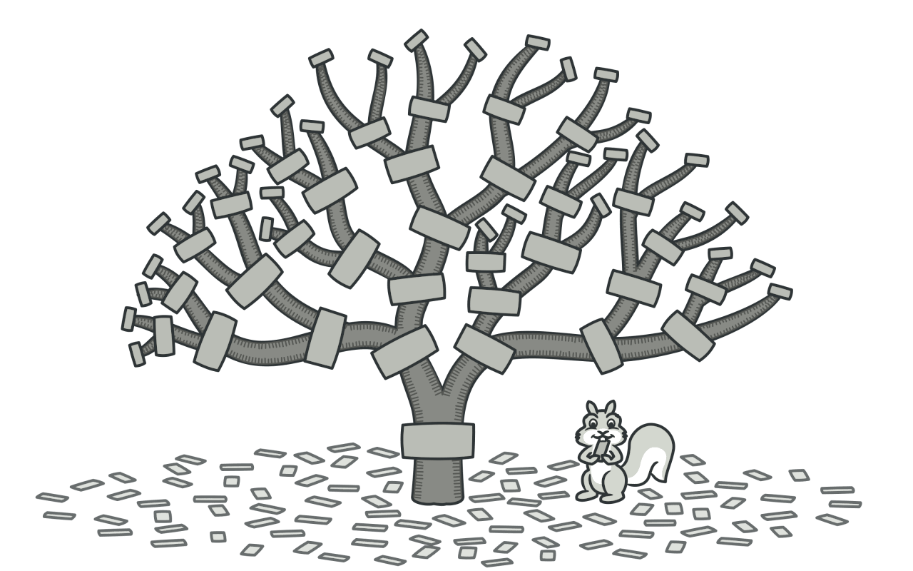
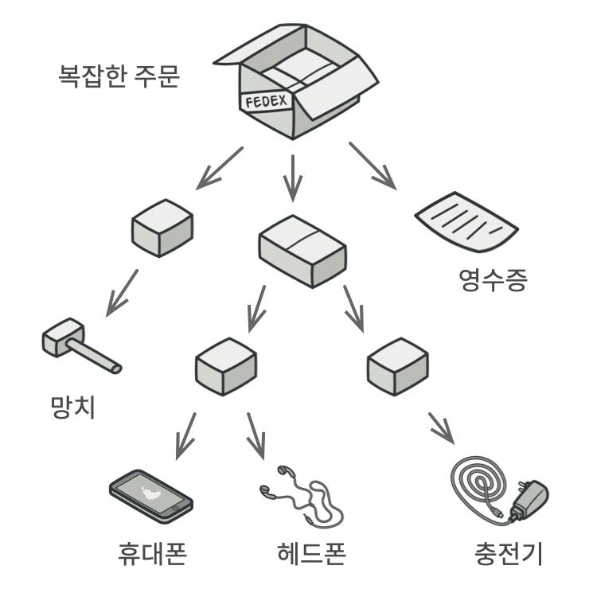
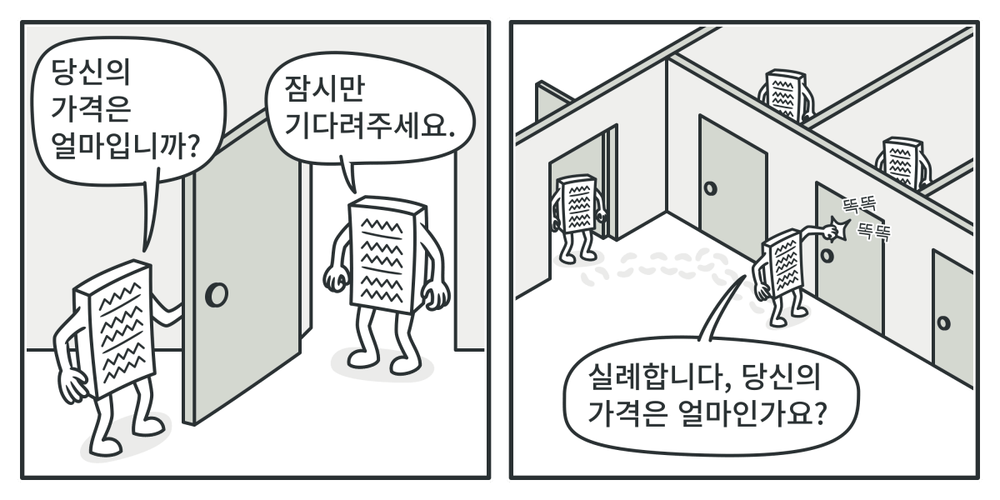

# 복합체 패턴
#### A.K.A 객체 트리、Composite

---
### 도입 의도
-  객체들을 트리 구조들로 구성한 후, 이러한 구조들과 개별 객체들처럼 작업할 수 있도록 하는 구조 패턴

### 문제

- 마치 거꾸로 된 나무 같은 구조로 구성된 복잡한 주문의 가격을 계산해야 한다.
- 하나하나 꺼내서 계산한다?
  - 모든 객체의 중첩 수준 및 복잡한 세부사항을 알아야 한다.
- 그렇다면 어떻게?

### 해결 방안

- 각 구현체와 같이 작업할 수 있는 공통 인터페이스를 도입한다!
  - 각각의 상품과 상자에 대해 가격이 얼마인지 계산하는 인터페이스를 사용...

### 구현방법
1. 구조가 트리 구조로 표현될 수 있는지 확인
2. 앱을 단순 요소와 컨테이너로 분리
3. 컴포넌트 인터페이스를 선언
4. 단순 요소들을 나타내는 리프 클래스와 컨테이너들을 나타내는 컨테이너 클래스를 생성
   - 대부분의 작업은 리프 클래스에 위임
5. 컨테이너에서 컴포넌트를 추가하고 제거하는 메서드를 구현
   - 이를 컴포넌트 인터페이스에서 선언하는 것은 인터페이스 분리 원칙을 위반한다.

### 장단점
- 장점
  - 다형성과 재귀를 사용하여 복잡한 구조를 편리하게 작업할 수 있다.
  - 객체 트리와 작동하는 기존 코드를 훼손하지 않고 새로운 요소를 추가할 수 있어 개방/폐쇄 원칙을 준수한다.
- 단점
  -  기능이 너무 다른 클래스들에는 공통 인터페이스를 제공하기 어려울 수 있다.
    - 이 경우, 과도한 일반화가 이루어져 오히려 이해하기 어렵게 만들 수 있다.

### 다른 패턴들과의 관계
- 빌더
  - 복합체를 생성할 때 사용할 수 있다.
- 책임 연쇄
  - 잎 컴포넌트가 요청을 받으면 해당 요청을 모든 부모 컴포넌트들의 체인을 통해 객체 트리의 뿌리까지 전달할 수 있다.
- 반복자
  - 반복자들을 이용해서 복합체 트리를 순회할 수 있다.
- 데코레이터
  - 복합체 패턴 및 데코레이터는 둘 다 구조 다이어그램이 유사하다.
    - 둘 다 재귀적인 합성에 의존하여 하나 또는 불특정 다수의 객체들을 정리하기 때문
  - 데코레이터는 복합체 패턴과 비슷하지만, 자식 컴포넌트가 하나만 있는 반면 복합체는 여러 개의 자식 컴포넌트를 가질 수 있다.
  - 데코레이터는 래핑된 객체에 추가 책임들을 추가하는 반면 복합체 패턴은 자신의 자식들의 결과를 '요약'하기만 한다.
  - 데코레이터를 사용하여 복합체 패턴 트리의 특정 객체의 행동을 확장할 수 있다.