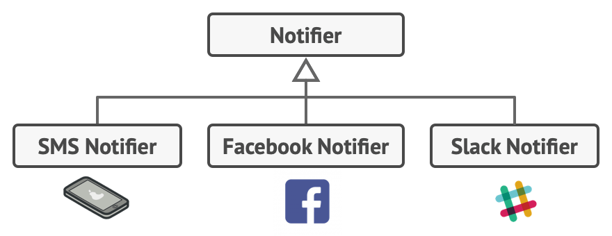
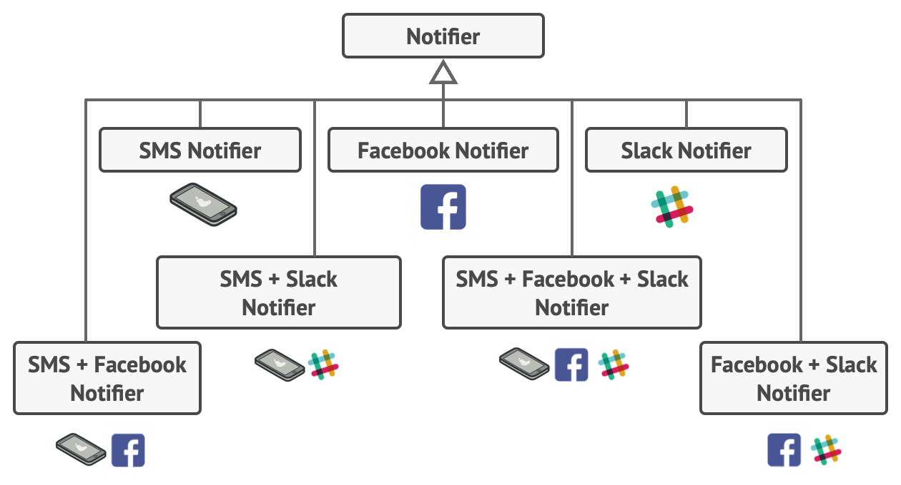
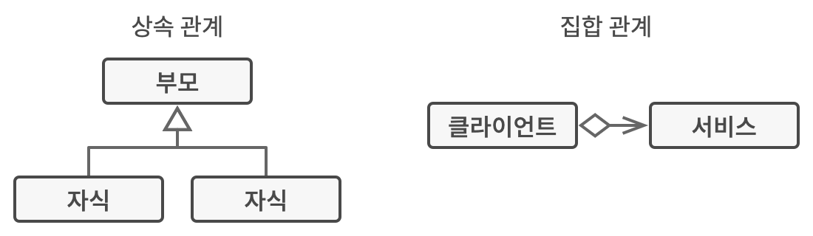

# 데코레이터 패턴
#### A.K.A 래퍼(Wrapper), Decorator

---
### 도입 의도
- 객체들을 새로운 행동들을 포함한 특수 래퍼 객체들 내에 넣어서 위 행동들을 해당 객체들에 연결시키는 구조 패턴

### 문제
- 알림 라이브러리에서 이메일로 중요한 이벤트 알림을 보내고 있다.
  - 이제 이메일로 보내는 것 외에도 푸시 알림을 보내고 싶다.
  - 누군가는 슬랙 알림을 받고 싶어한다.
  - 심지어 페이스북 메신저로도 알림을 받고 싶어한다.

- 이 모든 알림들을 각각 구현했더니, 이번엔 모든 수단으로 알림을 같이 받고 싶어 한다면?

### 해결 방안
- 상속 대신 집합 관계 혹은 객체 합성을 사용하여 문제 해결을 시도한다.

### 구현방법
1. 비즈니스 도메인이 여러 선택적 계층으로 감싸진 기본 컴포넌트로 표시될 수 있는지 확인한다.
2. 기본 컴포넌트와 선택적 계층들 양쪽에 공통적인 메서드들이 무엇인지 파악하고 컴포넌트 인터페이스를 정의한 뒤 해당 메서드들을 선언한다.
3. 구상 컴포넌트 클래스를 만든 후 그 안에 기초 행동들을 정의한다.
4. 기초 데코레이터 클래스를 만든 후 그 안에 기초 컴포넌트를 참조하는 필드를 추가한다.
5. 모든 클래스들이 컴포넌트 인터페이스를 구현하도록 한다.
6. 기초 데코레이터를 확장하여 구상 데코레이터들을 생성한다.

### 장단점
- 장점
  - 새 자식 클래스를 만들지 않고도 객체의 행동을 확장할 수 있다.
  - 런타임에 객체들에서부터 책임들을 추가하거나 제거할 수 있다.
  - 객체를 여러 데코레이터로 래핑하여 여러 행동들을 합성할 수 있다.
  - 다양한 행동들의 여러 변형들을 구현하는 모놀리식 클래스를 여러 개의 작은 클래스들로 나눌 수 있어 단일 책임 원칙을 준수한다.
- 단점
  - 래퍼들의 스택에서 특정 래퍼를 제거하기가 어렵다.
  - 데코레이터의 행동이 데코레이터 스택 내의 순서에 의존하지 않는 방식으로 데코레이터를 구현하기가 어렵다.
  - 계층들의 초기 설정 코드가 보기 흉할 수 있다.

### 다른 패턴들과의 관계
- 어댑터
  - 어댑터는 기존 객체의 인터페이스를 변경하는 반면 데코레이터는 객체를 해당 객체의 인터페이스를 변경하지 않고 향상시킨다.
  - 데코레이터는 어댑터를 사용할 때는 불가능한 재귀적 합성을 지원한다.
  - 어뎁터는 다른 인터페이스를, 데코레이터는 향상된 인터페이스를 래핑된 객체에 제공한다.
- 책임 연쇄
  - 책임 연쇄 패턴과 데코레이터는 클래스 구조가 매우 유사하나, 결정적인 차이점이 있다.
    - 책임 연쇄 패턴 핸들러들은 서로 독립적으로 임의의 작업을 실행할 수 있으며, 또한 해당 요청을 언제든지 더 이상 전달하지 않을 수 있다.
    - 다양한 데코레이터들은 객체의 행동을 확장하며 동시에 이러한 행동을 기초 인터페이스와 일관되게 유지할 수 있으며, 데코레이터들은 요청의 흐름을 중단할 수 없다.
- 복합체
  - 복합체 패턴 및 데코레이터는 둘 다 구조 다이어그램이 유사하다. 왜냐하면 둘 다 재귀적인 합성에 의존하여 하나 또는 불특정 다수의 객체들을 정리하기 때문이다.
    - 데코레이터는 복합체 패턴과 비슷하지만, 자식 컴포넌트가 하나만 있다.
    - 데코레이터는 래핑된 객체에 추가 책임들을 추가하는 반면 복합체 패턴은 자신의 자식들의 결과를 '요약'하기만 한다.