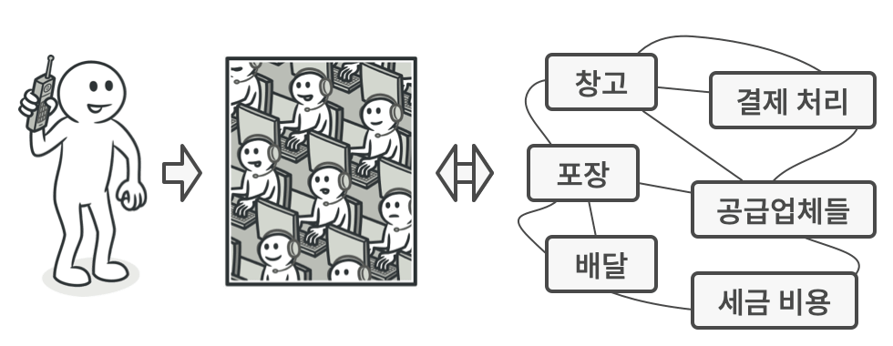

# 퍼사드 패턴
#### A.K.A Facade

---
### 도입 의도
- 라이브러리, 프레임워크 또는 다른 클래스들의 복잡한 집합에 대한 단순화된 인터페이스를 제공하는 구조적 디자인 패턴

### 문제
- 정교한 라이브러리나 프레임워크에 속하는 광범위한 객체들의 집합으로 당신의 코드를 작동하게 만들어야 한다고 가정하자.
- 이 때 일반적으로, 광범위한 객체들을 모두 초기화하고, 종속성 관계들을 추적하고, 올바른 순서로 메서드들을 실행하는 등의 작업을 수행해야 한다.
- 그 결과 클래스들의 비즈니스 로직이 타사 클래스들의 구현 세부 사항들과 밀접하게 결합하여 코드를 이해하고 유지 관리하기가 어려워진다.

### 해결 방안
- 복잡한 하위 시스템에 대한 간단한 인터페이스를 제공
  - 하위 시스템과 직접 작업하는 것과 비교하면 퍼사드는 제한된 기능성을 제공
  - 그러나 퍼사드에는 클라이언트들이 정말로 중요하게 생각하는 기능들만 포함되기에 대부분의 경우 충분하다.

### 구현방법
- 기존 하위시스템이 이미 제공하고 있는 것보다 더 간단한 인터페이스를 제공하는 것이 가능한지 확인
  - 이 인터페이스가 클라이언트 코드를 하위시스템의 여러 클래스로부터 독립시켜야 한다.
- 새 퍼사드 패턴 클래스에서 이 인터페이스를 선언하고 구현
  - 이 퍼사드는 클라이언트 코드의 호출들을 하위 시스템의 적절한 객체들로 리다이렉션해야 한다.
- 패턴을 최대한 활용하려면 모든 클라이언트 코드가 퍼사드 패턴을 통해서만 하위시스템과 통신하도록 한다.
  - 클라이언트 코드는 하위시스템 코드의 변경 사항들로부터 보호받을 수 있다.
- 파사드가 너무 커지면 새로운 파사드를 만들어야 한다.
### 장단점
- 장점
  - 복잡한 하위 시스템에서 코드를 별도로 분리할 수 있다.
- 단점
  퍼사드는 앱의 모든 클래스에 결합된 전지전능한 객체가 될 수 있다.

### 예시
- Apache HttpClient5 - httpclient5-fluent