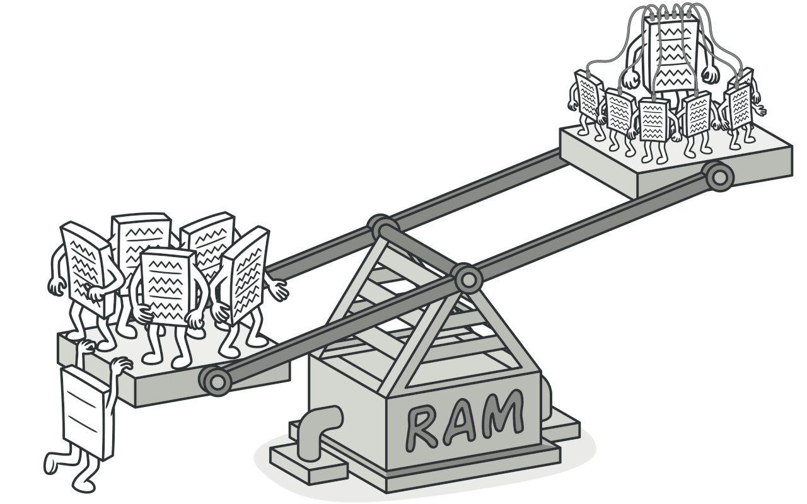

# 플라이웨이트 패턴
#### A.K.A 캐시, Flyweight

---
### 도입 의도

- 각 객체에 모든 데이터를 유지하는 대신 여러 객체들 간에 상태의 공통 부분들을 공유하여 사용할 수 있는 RAM에 더 많은 객체들을 포함할 수 있도록 하는 것

### 문제
- 반복되는 동일한 불변적 상태를 모든 객체가 각자 가지고 있다면?
- 그 객체들이 아주아주 많아진다면? RAM이 부족해질 것이다.

### 해결 방안
- 각 객체마다 고유하며 시간에 따라 변화하는 필드와 모든 객체가 공유할 수 있는 필드를 분리한다.
- 객체 내부에 공유한 상태의 저장을 중단하고, 대신 이 상태를 이 상태에 의존하는 특정 메서드들에 전달한다.
- 고유한 상태만 객체 내에 유지되므로 해당 고유한 상태는 콘텍스트가 다른 곳에서 재사용할 수 있다.
- 이러한 객체들은 공유한 상태보다 변형이 훨씬 적은 고유한 상태에서만 달라지므로 훨씬 더 적은 수의 객체만 필요하다.
- 이러한 객체들을 플라이웨이트라고 부른다.

### 구현방법
- 플라이웨이트가 될 클래스의 필드들을 두 부분으로 나눈다.
  - 고유한 상태: 많은 객체에 걸쳐 복제된 변경되지 않는 데이터를 포함하는 필드들
  - 공유한 상태: 각 객체에 고유한 콘텍스트 데이터를 포함하는 필드들
- 클래스의 고유한 상태를 나타내는 필드들은 그대로 두되 변경될 수 없도록 만든다.
- 공유한 상태의 필드들을 사용하는 메서드에 사용된 각 필드에 대해 새 매개변수를 도입하고 필드 대신 사용한다.
- 플라이웨이트들의 풀을 관리하기 위한 팩토리 클래스를 생성한다.
  - 팩토리는 플라이웨이트 객체를 생성하고 관리한다.
  - 팩토리는 클라이언트가 플라이웨이트 객체를 요청할 때마다 새로운 객체를 생성하는 대신 이미 존재하는 객체를 반환한다.
  - 클라이언트는 팩토리를 통해서만 플라이웨이트 객체에 접근할 수 있다.
- 클라이언트는 플라이웨이트 객체들의 메서드들을 호출할 수 있도록 공유한 상태의 값들을 저장하거나 계산해야 한다.

### 장단점
- 장점
  - 당신의 프로그램에 유사한 객체들이 많다고 가정하면 많은 RAM을 절약할 수 있다.
  - 여러 객체의 상태를 한 곳에 모아 둘 수 있다.
- 단점
  - 누군가가 플라이웨이트 메서드를 호출할 때마다 콘텍스트 데이터의 일부를 다시 계산해야 한다면 프로그램의 성능이 저하될 수 있다.
  - 코드가 복잡해지므로 새로운 팀원들은 왜 개체(entity)의 상태가 그런 식으로 분리되었는지 항상 궁금해할 것이다.
  - 특정 인스턴트만 다른 인스턴트와 다르게 행동할 수 없다.

### 다른 패턴들과의 관계