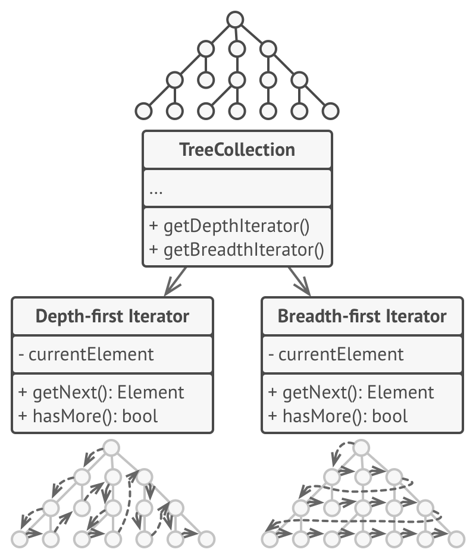

# 반복자 패턴
#### A.K.A Iterator

---
### 도입 의도
- 컬렉션의 요소들의 기본 표현(리스트, 스택, 트리 등)을 노출하지 않고 그들을 하나씩 순회할 수 있도록 하는 행동 디자인 패턴

### 문제
- 복잡한 구조의 다양한 컬렉션의 데이터 요소들을 어떻게 순차적으로 순회할 수 있는가?
- 컬렉션의 주요 책임은 효율적인 데이터 저장이나, 컬렉션에 더 많은 순회 알고리즘들을 추가할수록 컬렉션의 주요 책임이 무엇인지 점점 명확해지지 않게 됨
- 컬렉션들과 작동해야 하는 클라이언트 코드는 자신들의 요소가 어떻게 저장되는지 관심을 두지 않음

### 해결 방안

- 컬렉션의 순회 동작을 반복자라는 별도의 객체로 추출
- 여러 반복자들이 서로 독립적으로 동시에 같은 컬렉션을 통과할 수 있음
  - 반복자 객체는 알고리즘 자체를 구현하는 것 외에도 모든 순회 세부 정보들을 캡슐화하기 때문
- 모든 반복자들은 같은 인터페이스를 구현해야 함
- 컬렉션을 순회하는 특별한 방법이 필요하면 컬렉션이나 클라이언트를 변경할 필요 없이 새 반복자 클래스를 만들기만 하면 됨

### 구현방법
1. 반복자 인터페이스를 선언
    - 컬렉션에서 다음 요소를 가져오는 메서드가 있어야 함
    - 전 요소를 가져오는, 현재 위치를 추적하는, 그리고 반복자의 순회의 끝을 확인하는 메서드들처럼 다른 유용한 메서드를 추가할 수 있음
2. 컬렉션 인터페이스를 선언하고 반복자를 가져오는 메서드를 설명
    - 컬렉션 인터페이스의 반환 유형은 반복자 인터페이스의 유형과 같아야 함
3. 반복자들이 순회하게 할 수 있도록 하고 싶은 컬렉션들에 대한 구상 반복자 클래스들을 구현
4. 컬렉션 클래스들에서 컬렉션 인터페이스를 구현
    - 주된 목적은 클라이언트에 특정 컬렉션 클래스에 맞게 조정된 반복자들을 생성하기 위한 바로 가기를 제공하는 것
5. 클라이언트 코드를 살펴보면서 반복자들을 사용하여 모든 컬렉션 순회 코드들을 교체

### 장단점
- 장점
  - 부피가 큰 순회 알고리즘들을 별도의 클래스들로 추출하여 단일책임원칙을 준수하며 클라이언트 코드와 컬렉션들을 정돈할 수 있음
  - 새로운 유형의 컬렉션들과 반복자들을 구현할 수 있으며 이들을 아무것도 훼손하지 않은 체 기존의 코드에 전달할 수 있어 개방폐쇄원칙을 준수
  - 같은 컬렉션을 병렬로 순회할 수 있음
  - 순회를 지연하고 필요할 때 계속할 수 있음
- 단점
  - 단순한 컬렉션들과만 작동하는 경우 반복자 패턴을 적용하는 것은 과도할 수 있음
  - 반복자를 사용하는 것은 일부 특수 컬렉션들의 요소들을 직접 탐색하는 것보다 덜 효율적일 수 있

### 다른 패턴들과의 관계
- 복합체
  - 반복자를 사용하여 복합체 패턴 트리들을 순회할 수 있음
- 팩토리 메서드
  - 팩토리 메서드를 반복자와 함께 사용하여 컬렉션 자식 클래스들이 해당 컬렉션들과 호환되는 다양한 유형의 반복자들을 반환하도록 할 수 있음
- 메멘토
  - 메멘토 패턴을 반복자 패턴과 함께 사용하여 현재 순회 상태를 포착하고 필요한 경우 롤백할 수 있음
- 비지터
  - 비지터 패턴과 반복자 패턴을 함께 사용해 복잡한 데이터 구조를 순회하여 해당 구조의 요소들의 클래스들이 모두 다르더라도 이러한 요소들에 대해 어떤 작업을 실행할 수 있음