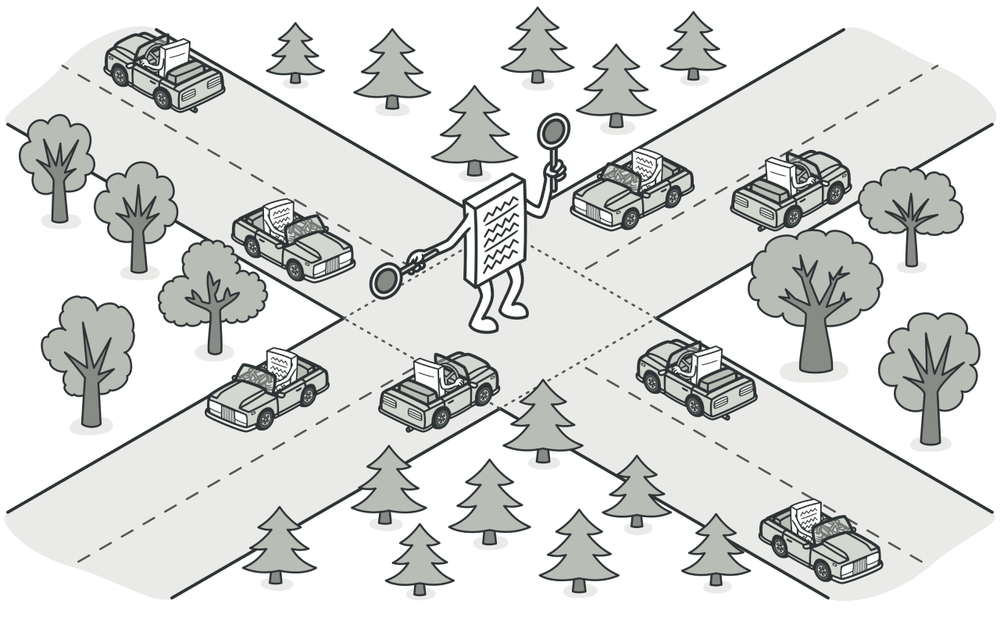
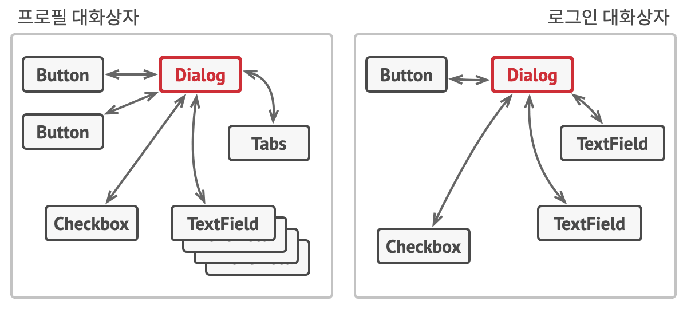

# 중재자 패턴
#### A.K.A 중개인, 컨트롤러, Mediator

---
### 도입 의도

- 객체 간의 직접 통신을 제한하고 중재자 객체를 통해서만 협력하도록 해 객체 간의 혼란스러운 의존 관계들을 줄일 수 있는 행동 디자인 패턴

### 문제
- 고객들의 프로필을 만들고 편집하기 위한 대화 상자가 있다고 가정
- 일부 양식 요소들은 다른 요소들과 상호 작용할 수 있음
- 이 때, 이 논리를 양식 요소들의 코드 내에서 직접 구현하면 이러한 요소들의 클래스들을 앱의 다른 양식들에서 재사용하기가 훨씬 더 어려워짐

### 해결 방안

- 서로 독립적으로 작동해야 하는 컴포넌트 간의 모든 직접 통신을 중단한 후, 대신 이러한 컴포넌트들은 호출들을 적절한 컴포넌트들로 리다이렉션하는 특수 중재자 객체를 호출하여 간접적으로 협력하게 하라고 제안
- 컴포넌트들은 수십 개의 동료 컴포넌트들과 결합되는 대신 단일 중재자 클래스에만 의존하게 됨
  - 위의 이미지에서 제출 버튼을 살펴보면 이전에는 사용자가 이 버튼을 클릭할 때마다 버튼은 모든 개별 양식 요소들의 값들을 검증해야 했음
  - 이제 제출 버튼이 해야 할 유일한 일은 클릭을 대화 상자에 알리는 것 하나 뿐
    - 이 알림을 받으면 대화 상자는 스스로 검증을 수행하거나 개별 요소들에게 작업을 전달
    -  따라서 버튼은 여러 개의 양식 요소들에 연결되는 대신 대화 상자 클래스에만 의존하게 됨

### 구현방법
1. 더 독립적으로 만들었을 때 클래스의 유지 관리가 더 쉬워지거나 재사용이 더 간편해지는 등의 이점이 있는 단단히 결합된 클래스들을 식별
2. 중재자 인터페이스를 선언하고 중재자와 다양한 컴포넌트 간의 원하는 통신 프로토콜을 설명
    - 이 인터페이스는 다른 콘텍스트들에서 컴포넌트 클래스들을 재사용하고자 할 때 매우 중요합니다. 컴포넌트가 일반 인터페이스를 통해 중재자와 함께 작동하는 한 컴포넌트를 중재자의 다른 구현과 연결할 수 있음
3. 구상 중재자 클래스를 구현
    - 중재자가 컴포넌트 객체들의 생성 및 파괴를 담당하도록 할 수 있으며, 그러면 중재자는 팩토리 또는 퍼사드와 유사할 수 있음
4. 컴포넌트들은 중재자 객체에 대한 참조를 저장
    - 이 연결은 일반적으로 컴포넌트의 생성자에서 설정되며 중재자 객체가 인수로 전달됨
5. 다른 컴포넌트들의 메서드 대신 중재자의 알림 메서드를 호출하도록 컴포넌트의 코드를 변경

### 장단점
- 장점
  - 다양한 컴포넌트 간의 통신을 한곳으로 추출하여 코드를 이해하고 유지 관리하기 쉽게 만들 수 있어 단일책임원칙을 준수
  - 실제 컴포넌트들을 변경하지 않고도 새로운 중재자들을 도입할 수 있어 개방폐쇄원칙을 준수
  - 프로그램의 다양한 컴포넌트 간의 결합도를 줄일 수 있음
  - 개별 컴포넌트들을 더 쉽게 재사용할 수 있음
- 단점
  - 중재자는 전지전능한 객체로 발전할 가능성이 있

### 다른 패턴들과의 관계
- 커맨드, 중재자, 옵서버 및 책임 연쇄 패턴은 요청의 발신자와 수신자를 연결하는 다양한 방법을 다룸
  - 책임 연쇄 패턴은 잠재적 수신자의 동적 체인을 따라 수신자 중 하나에 의해 요청이 처리될 때까지 요청을 순차적으로 전달함
  - 커맨드 패턴은 발신자와 수신자 간의 단방향 연결을 설립함
  - 중재자 패턴은 발신자와 수신자 간의 직접 연결을 제거하여 그들이 중재자 객체를 통해 간접적으로 통신하도록 강제함
  - 옵서버 패턴은 수신자들이 요청들의 수신을 동적으로 구독 및 구독 취소할 수 있도록 함
- 퍼사드
  - 중재자와 퍼사드 패턴은 비슷한 역할을 함
    - 퍼사드 패턴은 객체들의 하위 시스템에 대한 단순화된 인터페이스를 정의하지만 새로운 기능을 도입하지는 않음
      - 하위 시스템 자체는 퍼사드를 인식하지 못하며, 하위 시스템 내의 객체들은 서로 직접 통신할 수 있음
    - 중재자는 시스템 컴포넌트 간의 통신을 중앙 집중화
      - 컴포넌트들은 중재자 객체에 대해서만 알며 서로 직접 통신하지 못함
