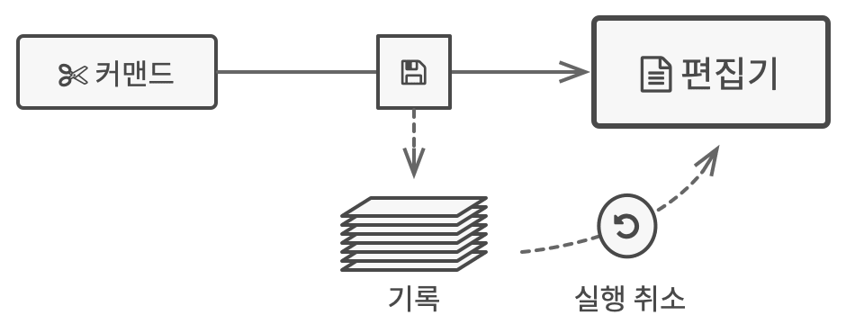
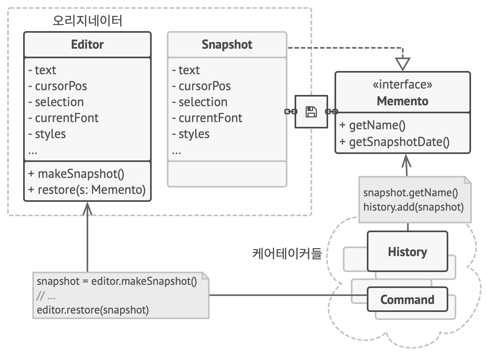

# 메멘토 패턴
#### A.K.A 스냅샷、Memento

---
### 도입 의도
- 객체의 구현 세부 사항을 공개하지 않으면서 해당 객체의 이전 상태를 저장하고 복원할 수 있게 해주는 행동 디자인 패턴

### 문제

- 작업 취소 기능을 구현하려고 할 때, 객체의 상태를 저장하고 복원하는 방법이 필요하다.
- 객체의 모든 내용을 복사하고 저장한다면?
  - 대부분의 객체는 중요한 내용을 private 필드에 숨기기에 상태를 알 수 없는 경우가 많음
  - 설령 상태를 모두 알 수 있다 하더라도 복사하려는 객체의 거의 모든 내용이 담긴 컨테이너 객체를 새로 만들어야 함
    - 이 컨테이너 객체, 즉 스냅샷 클래스는 다른 객체들이 접근하여 데이터를 읽고 쓸 수 있게 해야 하므로 너무 취약해짐

### 해결 방안

- 이상의 문제는 캡슐화의 실패로 인해 발생함
- 메멘토라는 특수 객체에 객체 상태의 복사본을 저장하라고 제안
  - 상태 스냅샷들의 생성을 해당 상태의 실제 소유자인 originator(오리지네이터) 객체에 위임
  - 메멘토의 내용에는 메멘토를 생성한 객체 외에는 누구도 접근할 수 없음 
- 이러한 제한 정책을 사용하면 일반적으로 케어테이커라고 하는 다른 객체들 안에 메멘토들을 저장할 수 있음
  - 케어테이커는 제한된 인터페이스를 통해서만 메멘토와 작업하기 때문에 메멘토 내부에 저장된 상태를 변경할 수 없음
  - 동시에 오리지네이터는 메멘토 내부의 모든 필드에 접근할 수 있으므로 언제든지 자신의 이전 상태를 복원할 수 있음

### 구현방법
1. 어떤 클래스가 오리지네이터의 역할을 할 것인지 결정
2. 메멘토 클래스를 만들어 오리지네이터 클래스 내부에 선언된 필드들을 미러링하는 필드들의 집합을 선언
   - 메멘토 클래스는 불변이어야 함
     - 메멘토는 생성자를 통해 데이터를 한 번만 받아야 하며, 그 클래스에는 setter들이 없어야 함
     - 사용하고 있는 프로그래밍 언어가 중첩 클래스를 지원하면 오리지네이터 내부에 메멘토를 중첩 클래스로 선언
     - 그렇지 않은 경우, 메멘토 클래스에서 빈 인터페이스를 추출한 후 다른 모든 객체가 메멘토를 참조하는 데 사용하도록 함
3. 오리지네이터 클래스에 메멘토들을 생성하는 메서드를 추가
   - 오리지네이터는 자신의 상태를 메멘토의 생성자의 하나 또는 여러 인수들을 통해 메멘토에게 전달
4. 오리지네이터의 클래스에 자신의 상태를 복원하는 메서드를 추가
   - 이 메서드는 메멘토 객체를 인수로 받아들임
   - 이전 단계에서 인터페이스를 추출했다면 이 인터페이스의 유형을 매개변수의 유형으로 지정
5. 케어테이커 클래스를 만들어 오리지네이터 객체의 상태를 저장하고 복원하는 메서드를 추가
    - 새로운 메멘토들을 오리지네이터로부터 언제 요청해야 하는지 알아야 함
    - 메멘토들을 어떻게 저장하고, 언제 특정 메멘토로부터 오리지네이터를 복원해야 하는지를 알아야 함
6. 케어테이커들과 오리지네이터들 간의 연결은 메멘토 클래스로 이동시킬 수 있음

### 장단점
- 장점
  - 캡슐화를 위반하지 않고 객체의 상태의 스냅샷들을 생성할 수 있음
  - 케어테이커가 오리지네이터의 상태의 기록을 유지하도록 하여 오리지네이터의 코드를 단순화할 수 있음
- 단점
  - 클라이언트들이 메멘토들을 너무 자주 생성하면 앱이 많은 RAM을 소모할 수 있음
  - 케어테이커들은 더 이상 쓸모없는 메멘토들을 파괴할 수 있도록 오리지네이터의 수명주기를 추적해야 함
  - PHP, 파이썬 및 JavaScript와 같은 대부분의 동적 프로그래밍 언어에서는 메멘토 내의 상태가 그대로 유지된다고 보장할 수 없음

### 다른 패턴들과의 관계
- 커맨드
  - '실행 취소'를 구현할 때 커맨드와 메멘토 패턴을 함께 사용할 수 있음
    - 커맨드들은 대상 객체에 대해 다양한 작업을 수행하는 역할
    - 메멘토들은 커맨드가 실행되기 직전에 해당 객체의 상태를 저장
- 반복자
  - 메멘토 패턴을 반복자 패턴과 함께 사용하여 현재 순회 상태를 포착하고 필요한 경우 롤백할 수 있음
- 프로토타입
  - 때로는 프로토타입이 메멘토 패턴의 더 간단한 대안이 될 수 있음
    - 상태를 기록에 저장하려는 객체가 간단하고 외부 리소스에 대한 링크가 없거나 링크들이 있어도 이들을 재설정하기 쉬운 경우에 작동