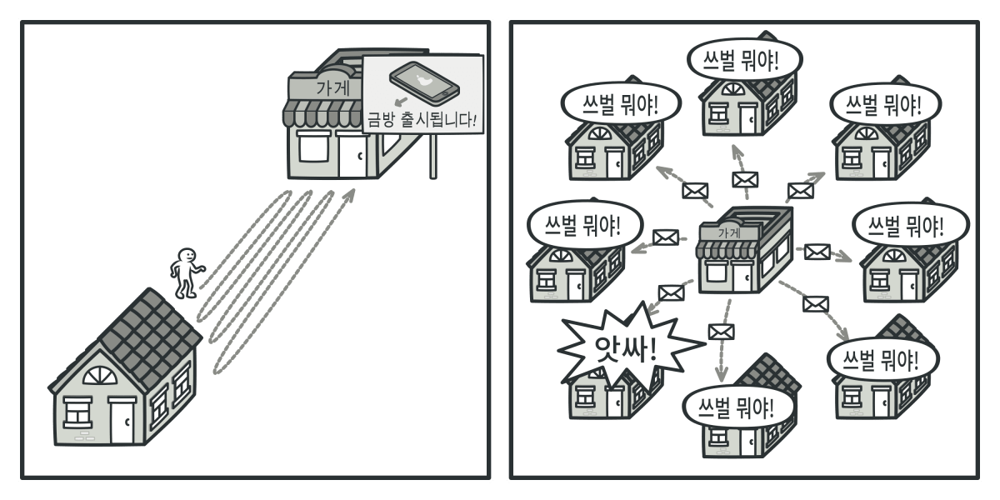
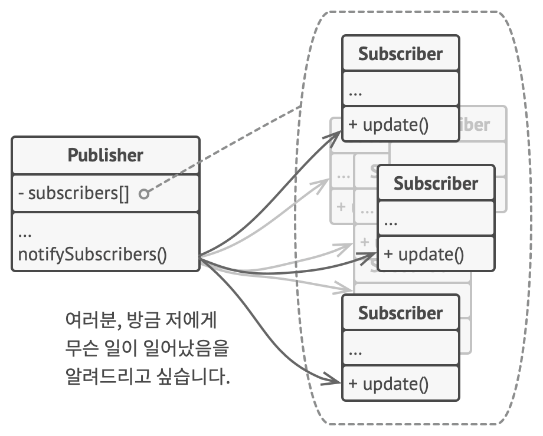

# 옵서버 패턴
#### A.K.A 이벤트 구독자, 경청자, Observer

---
### 도입 의도
- 옵서버 패턴은 당신이 여러 객체에 자신이 관찰 중인 객체에 발생하는 모든 이벤트에 대하여 알리는 구독 메커니즘을 정의할 수 있도록 하는 행동 디자인 패턴

### 문제

- Customer(손님) 및 Store(가게)라는 두 가지 유형의 객체들이 있다고 가정
  - 가게에 신상품이 출시되는 것을 어떻게 손님이 알 수 있을까?
    - 손님은 가게에 직접 물어보거나, 가게의 사이트를 주기적으로 방문하여 확인해야 한다
    - 혹은 가게에서 손님에게 홍보 메일을 보내는 방법도 있다
  - 이러한 방법들은 모두 비효율적이다
    - 손님이 매번 가게를 확인하는 것은 번거롭다
    - 가게에서 매번 홍보 메일을 보낸다면 이는 신상품 출시에 관심 없는 손님에겐 스팸메일이 된다

### 해결 방안

- 구독 매커니즘의 도입
  - Pub/Sub 구조를 도입하여 신상품의 정보를 알고 싶은 고객은 가게에 구독을 신청하고, 가게는 신상품이 출시될 때마다 구독자에게 알림을 보낸다

### 구현방법
1. 비즈니스 로직을 살펴보고 Publisher(발행자)와 Subscriber(구독자)를 식별
2. Publisher와 Subscriber의 인터페이스를 정의
   - Subscriber는 최소한 하나의 Update 메서드를 선언해야 함
   - Publisher는 Subscriber를 등록하고 해지하는 메서드를 선언해야 함
   - Publisher는 Subscriber의 인터페이스를 통해서만 Subscriber와 통신해야 함
3. 구상 Publisher 클래스들을 생성
   - Publisher 내부에서 중요한 일이 발생할 때마다 모든 Subscriber에게 알림을 전달
4. 구상 Subscriber 클래스들에서 Update 알림 메서드들을 구현
5. 클라이언트는 필요한 모든 구독자를 생성하고 적절한 출판사들과 등록

### 장단점
- 장점
  - Publisher와 Subscriber 간의 결합도가 낮고 개방 폐쇄 원칙을 준수한다
  - 런타임에 객체 간의 관계들을 형성할 수 있다
- 단점
  -  구독자들은 무작위로 알림을 받음 (??)

### 다른 패턴들과의 관계
- 커맨드, 중재자, 옵서버 및 책임 연쇄 패턴은 요청의 발신자와 수신자를 연결하는 다양한 방법을 다룬다
  - 책임 연쇄 패턴은 잠재적 수신자의 동적 체인을 따라 수신자 중 하나에 의해 요청이 처리될 때까지 요청을 순차적으로 전달
  - 커맨드 패턴은 발신자와 수신자 간의 단방향 연결을 설립
  - 중재자 패턴은 발신자와 수신자 간의 직접 연결을 제거하여 그들이 중재자 객체를 통해 간접적으로 통신하도록 강제
  - 옵서버 패턴은 수신자들이 요청들의 수신을 동적으로 구독 및 구독 취소할 수 있도록 함
- 중재자
  - 중재자와 옵서버 패턴의 차이는 종종 애매하다
    - 중재자의 주목적은 시스템 컴포넌트들의 집합 간의 상호 의존성을 제거하는 것
    - 옵서버 패턴에 의존하는 중재자 패턴의 인기 있는 구현이 있음
      - 중재자 객체는 출판사의 역할을 맡고, 컴포넌트들은 중재자의 이벤트들을 구독 및 구독 취소하는 구독자들의 역할을 맡는 것
      - 중재자가 이러한 방식으로 구현되면 옵서버 패턴과 매우 유사하게 보일 수 있음
    - 중재자 패턴을 다른 방법들로 구현할 수 있음을 기억