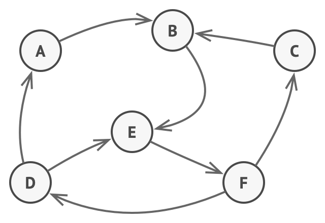

# 상태 패턴
#### A.K.A State

---
### 도입 의도
- 상태 패턴은 객체의 내부 상태가 변경될 때 해당 객체가 그의 행동을 변경할 수 있도록 하는 행동 디자인 패턴이다

### 문제

- 상태 패턴은 유한 상태 기계개념과 밀접하게 관련되어 있음
- 예를 들어 Document라는 클래스가 있을 때, 이 클래스의 상태는 제한적임
  - Draft(초안), Moderation(검토) 및 Published(출판됨)의 세 가지 상태 중 하나일 수 있음
  - Document 클래스의 publish 메서드는 Document의 상태에 따라 다르게 작동해야 함
    - 초안 상태에서는 publish 메서드가 문서를 검토 상태로 변경
    - 검토 상태에서는 publish 메서드가 문서를 출판 상태로 변경
      - 단, 현재 사용자가 검토 권한이 있는 관리자인 경우에만 가능
    - 출판됨 상태에서는 publish 메서드가 아무런 효과를 주지 않아야 함
- 이런 상태 머신을 조건문으로 구현하려고 하면 지나치게 거대한 조건문이 만들어질 수 있음
- 또한, 새로운 상태가 추가되거나 기존 상태가 변경될 때마다 복잡도가 더욱 올라감

### 해결 방안
- 상태 패턴은 객체의 모든 가능한 상태들에 대해 새 클래스들을 만들고 모든 상태별 행동들을 이러한 클래스들로 추출할 것을 제안
- 콘텍스트라는 현재 상태를 나타내는 상태 객체 중 하나에 대한 참조를 저장하고 모든 상태와 관련된 작업을 그 객체에 위임
  - 콘텍스트를 다른 상태로 전환하려면 활성 상태 객체를 새 상태를 나타내는 다른 객체로 교체

### 구현방법
1. 어떤 클래스가 콘텍스트로 작동할지 결정
2. 상태 인터페이스를 선언
3. 모든 실제 상태에 대해 상태 인터페이스에서 파생된 클래스를 생성
    - 코드가 콘텍스트의 비공개 멤버들에 의존하는 경우 해결법
      - 이 필드들 또는 메서드들을 public으로 전환
      - 추출하는 행동을 콘텍스트의 공개된 메서드로 전환하고 상태 클래스에서 호출
      - 사용 중인 프로그래밍 언어가 중첩 클래스들을 지원하는 경우에 한해 상태 클래스들을 콘텍스트 클래스에 중첩
4. 콘텍스트 클래스에서 상태 인터페이스 유형의 참조 필드와 필드의 값을 오버라이드할 수 있는 공개된 setter를 추가
5. 콘텍스트의 메서드를 다시 살펴보고 빈 상태 조건문들을 상태 객체의 해당하는 메서드들에 대한 호출들로 대체
6. 콘텍스트의 상태를 전환하려면 상태 클래스 중 하나의 인스턴스를 만든 후 콘텍스트에 전달

### 장단점
- 장점
  - 특정 상태들과 관련된 코드를 별도의 클래스들로 구성하므로 단일 책임 원칙을 준수
  - 기존 상태 클래스들 또는 콘텍스트를 변경하지 않고 새로운 상태들을 도입하므로 개방 폐쇄 원칙을 준수
  - 거대한 상태 머신 조건문들을 제거하여 콘텍스트의 코드를 단순화함
- 단점
  -  상태 머신에 몇 가지 상태만 있거나 머신이 거의 변경되지 않을 때 상태 패턴을 적용하는 것은 과도할 수 있

### 다른 패턴들과의 관계
- 브리지, 상태, 전략, 어댑터 패턴
  - 상태 패턴과 매우 유사한 구조로 되어있음
  - 위 모든 패턴은 다른 객체에 작업을 위임하는 합성을 기반으로 함
- 전략 패턴
  - 상태는 전략의 확장으로 간주할 수 있음
  - 공통점
    - 모두 합성을 기반으로 함
    - 어떤 작업을 도우미 객체들에 전달하여 콘텍스트의 행동을 바꿈
  - 차이점
    - 전략 패턴은 이러한 객체들을 완전히 독립적으로 만들어 서로를 인식하지 못하도록 만듬
    - 그러나 상태는 구상 상태들 사이의 의존 관계들을 제한하지 않으므로 그들이 콘텍스트의 상태를 마음대로 변경할 수 있도록 함