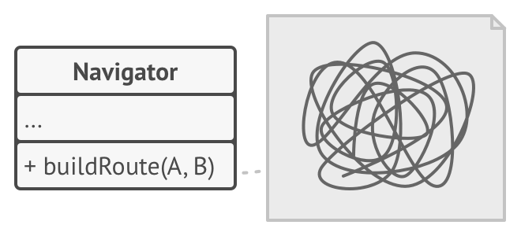
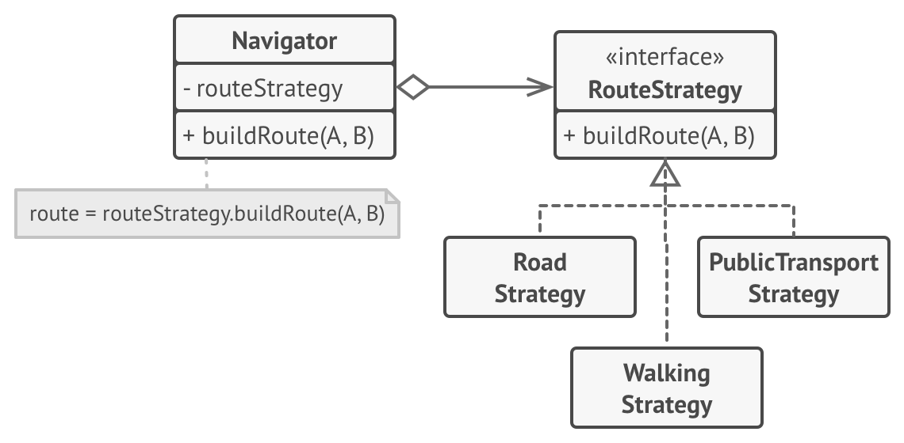

# 전략 패턴
#### A.K.A Strategy

---
### 도입 의도
- 알고리즘들의 패밀리를 정의하고, 각 패밀리를 별도의 클래스에 넣은 후 그들의 객체들을 상호교환할 수 있도록 하는 행동 디자인 패턴

### 문제

- 자동 경로 기능을 지원하는 내비 앱을 개발
- 처음에는 자동차 경로를 제공하는 알고리즘을 사용했지만, 추후 도보 경로를 제공하는 알고리즘을 사용하고 싶어짐
- 그 뒤 대중교통 경로를 추가하고... 자전거 경로를 추가하고... 앱이 지나치게 복잡하고 유지하기 힘들어짐

### 해결 방안
- 특정 작업을 다양한 방식으로 수행하는 클래스를 선택한 후 모든 알고리즘을 전략들(strategies)이라는 별도의 클래스들로 추출하는 전략 패턴을 도입
- 콘텍스트라 불리는 원래 클래스에는 전략 중 하나에 대한 참조를 저장하기 위한 필드가 있어야 함
  - 콘텍스트는 작업을 자체적으로 실행하는 대신 연결된 전략 객체에 위임
  - 콘텍스트는 같은 일반 인터페이스를 통해 모든 전략과 함께 작동하며, 이 일반 인터페이스는 선택된 전략 내에 캡슐화된 알고리즘을 작동시킬 단일 메서드만 노출됨
- 콘텍스트가 구상 전략들에 의존하지 않게 되므로 콘텍스트 또는 다른 전략들의 코드를 변경하지 않고도 새 알고리즘들을 추가하거나 기존 알고리즘들을 수정할 수 있

### 구현방법
1. 콘텍스트 클래스에서 자주 변경되는 알고리즘을 식별
2. 알고리즘의 모든 변형에 공통인 전략 인터페이스를 선언
3. 하나씩 모든 알고리즘을 자체 클래스들로 추출
   - 모두 전략 인터페이스를 구현해야 함
4. 콘텍스트 클래스에서 전략 객체에 대한 참조를 저장하기 위한 필드를 추가한 후, 해당 필드의 값을 대체하기 위한 세터를 제공
    - 콘텍스트는 전략 인터페이스를 통해서만 전략 객체와 작동해야 함
    - 콘텍스트는 인터페이스를 정의할 수 있으며, 이 인터페이스는 전략이 콘텍스트의 데이터에 접근할 수 있도록 함
5. 콘텍스트의 클라이언트들은 콘텍스트를 적절한 전략과 연관시킴

### 장단점
- 장점
  - 런타임에 한 객체 내부에서 사용되는 알고리즘들을 교환할 수 있음
  - 알고리즘을 사용하는 코드에서 알고리즘의 구현 세부 정보들을 고립할 수 있음
  - 콘텍스트를 변경하지 않고도 새로운 전략들을 도입할 수 있어 개방 폐쇄 원칙을 준수
  - 상속을 합성으로 대체할 수 있음
- 단점
  - 알고리즘이 몇 개밖에 되지 않고 거의 변하지 않는다면 해당 패턴을 도입하기에 비용이 더 클 수 있음
  - 클라이언트들은 적절한 전략을 선택할 수 있도록 전략 간의 차이점들을 알고 있어야 함
  - 굳이 클래스와 인터페이스를 사용하는 본 패턴을 도입하는 대신 함수형 지원을 이용해 동일한 목적을 이룰 수도 있음