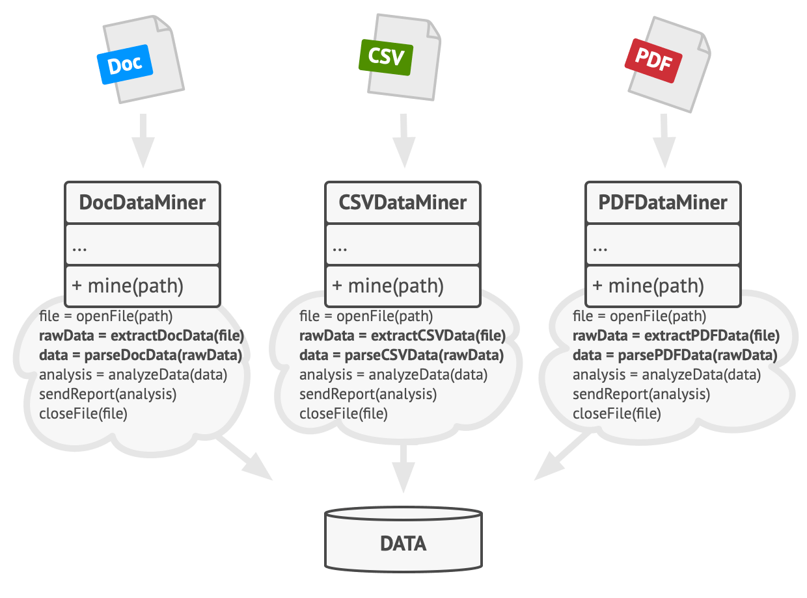
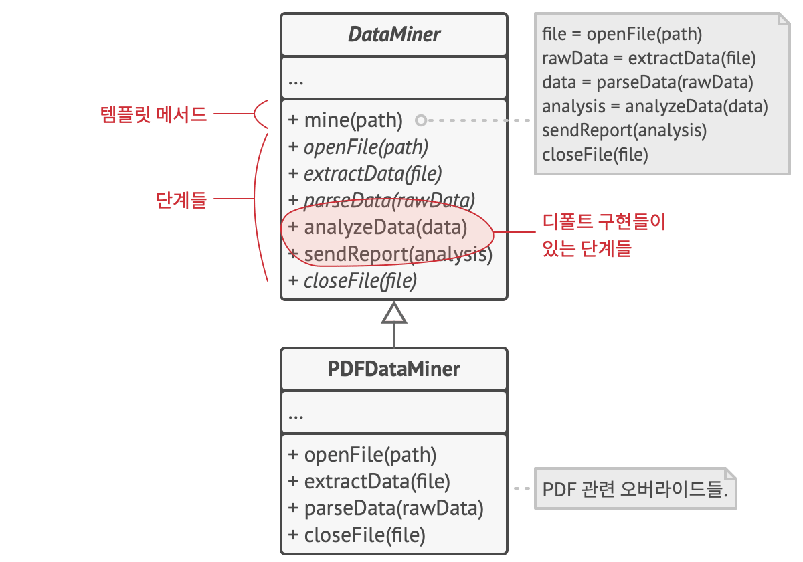

# 템플릿 메서드 패턴
#### A.K.A Template Method

---
### 도입 의도
- 부모 클래스에서 알고리즘의 골격을 정의하지만, 해당 알고리즘의 구조를 변경하지 않고 자식 클래스들이 알고리즘의 특정 단계들을 재정의할 수 있도록 하는 행동 디자인 패턴

### 문제

- 회사 문서들을 분석하는 데이터 마이닝 앱을 만들고 있다고 가정
- 앱의 첫 번째 버전은 DOC 파일과만 작동할 수 있었고, 다음 버전에서는 CSV 파일을 지원. 한 달 후, PDF 파일도 지원하게 됨
- 이러한 파일들을 처리하는 각 클래스에 공통된 내용이 매우 많다면? 코드 중복을 제거하고 싶어짐

### 해결 방안
- 알고리즘을 일련의 단계들로 나누고, 이러한 단계들을 메서드들로 변환한 뒤, 단일 템플릿 메서드 내부에 이러한 메서드들에 대한 일련의 호출들을 넣으라고 제안하는 템플릿 메서드 패턴을 도입
- 알고리즘을 사용하기 위해선?
  - 클라이언트는 자신의 자식 클래스를 제공해야 함
  - 클라이언트는 모든 추상 단계를 구현해야 함
  - 클라이언트는 필요하다면 선택적 단계 중 일부를 재정의해야 함

  - 중복된 내용을 디폴트 구현이 있는 단계로 분리
    - 필요하다면 이를 재정의해서 사용할 수 있음

### 구현방법
1. 대상 알고리즘을 분석하여 여러 단계로 나눌 수 있는지 확인
2. 추상 기초 클래스를 만들고 알고리즘의 단계들을 표현하는 템플릿 메서드와 추상 메서드들의 집합을 선언
   - 해당 단계에서 템플릿 메서드에서 알고리즘의 구조의 윤곽을 잡음
   - 필요하다면 템플릿 메서드를 final로 선언하여 오버라이드를 방지
3. 필요 시 일부 단계들에는 디폴트 구현을 제공
   - 자식 클래스들은 이러한 디폴트 메서드들을 구현할 필요가 없음
4. 알고리즘의 중요한 단계들 사이에 훅들을 추가하는 것을 고려
5. 알고리즘의 각 변형에서 새로운 구상 자식 클래스를 생성
    - 새로운 구상 자식 클래스는 모든 추상 단계들을 반드시 구현해야 하지만 일부 선택 단계를 오버라이드할 수도 있음

### 장단점
- 장점
  - 클라이언트들이 대규모 알고리즘의 특정 부분만 오버라이드하도록 하여 그들이 알고리즘의 다른 부분에 발생하는 변경에 영향을 덜 받도록 할 수 있음
  - 중복 코드를 부모 클래스로 가져올 수 있음 (디폴트 메서드)
- 단점
  - 클라이언트들은 알고리즘의 제공된 인터페이스에 의해 제한될 수 있음
  - 자식 클래스를 통해 디폴트 단계 구현을 억제하여 리스코프 치환 원칙을 위반할 수 있음
  - 템플릿 메서드들은 단계들이 더 많을수록 유지가 더 어려운 경향이 있음