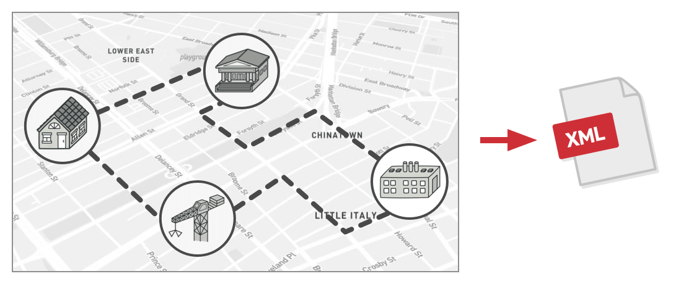

# 비지터 패턴
#### A.K.A Visitor

---
### 도입 의도
- 알고리즘들을 그들이 작동하는 객체들로부터 분리할 수 있도록 하는 행동 디자인 패턴

### 문제

- 하나의 거대한 그래프로 구성된 지리 정보를 사용해 작동하는 앱을 개발하고 있다고 가정
  - 그래프의 각 노드는 도시와 같은 복잡한 객체를 나타낼 수 있지만 산업들, 관광 지역들 등의 더 세부적인 항목들도 나타낼 수 있음
- 어느 날 그래프를 XML 형식으로 내보내는 기능을 추가하게 됨
- 그런데 기존 시스템의 설계자는 기존 노드 클래스들을 변경하는 것을 허용하지 않는다면?

### 해결 방안
- 새로운 행동을 기존 클래스들에 통합하는 대신 visitor(방문자)라는 별도의 클래스에 배치
- 행동을 수행해야 했던 원래 객체는 visitor의 메서드 중 하나에 인수로 전달됨
- 그러면 메서드는 원래 객체 내에 포함된 모든 필요한 데이터에 접근할 수 있음
- 그런데 이러한 메서드들을 정확히 어떻게 호출할까
  - 메서드 오버로딩? 노드 객체의 정확한 클래스를 사전에 알 수 없으므로, 오버로딩 메커니즘은 실행해야 할 올바른 메서드가 무엇인지 판단할 수 없음
  - 더블 디스패치라는 방법을 사용하여 해결
    - 클라이언트가 호출할 메서드의 적절한 버전을 선택하도록 하는 대신 이 선택권을 비지터에게 인수로 전달되는 객체에게 위임
    - 이러한 객체들은 자신의 클래스들을 알고 있으므로 비지터에 대한 적합한 메서드를 더 쉽게 선택할 수 있음
    - 그들은 비지터를 '수락'하고 어떤 비지터 메서드가 실행되어야 하는지 알려줌

### 구현방법
1. 프로그램에 존재하는 각 구상 요소 클래스당 하나씩 'visitor(방문자)' 메서드를 만들고 이 메서드들의 집합으로 비지터 인터페이스를 선언
    - 요소 클래스들은 비지터 인터페이스를 통해서만 비지터와 작동해야 함
    - 그러나, 비지터들은 비지터 메서드들의 매개변수 유형들로 참조된 모든 구상 요소 클래스들에 대해 알고 있어야 함
2. 요소 인터페이스를 선언
    - 기존 요소 클래스 계층구조와 작업하는 경우 계층구조의 기초 클래스에 추상 수락 메서드를 추가
    - 이 메서드는 비지터 객체를 인수로 받아들임
3. 모든 구상 요소 클래스들에서 수락 메서드들을 구현
    - 이 메서드들은 비지터 메서드에 대한 호출을 들어오는 비지터 객체에 리다이렉트
4. 요소 계층구조 내에서 구현할 수 없는 각 행동의 경우, 새로운 구상 비지터 클래스를 만들고 모든 비지터 메서드들을 구현
5. 클라이언트는 비지터 객체들을 만들고 '수락' 메서드들을 통해 그것들을 요소들에 전달

### 장단점
- 장점
  - 다른 클래스를 변경하지 않으면서 해당 클래스의 객체와 작동할 수 있는 새로운 행동을 도입할 수 있어 개방 폐쇄 원칙을 준수
  - 같은 행동의 여러 버전을 같은 클래스로 이동할 수 있어 단일 책임 원칙을 준수
  - 비지터 객체는 다양한 객체들과 작업하면서 유용한 정보를 축적할 수 있음
    - 객체 트리와 같은 복잡한 객체 구조를 순회하여 이 구조의 각 객체에 비지터 패턴을 적용하려는 경우에 유용
- 단점
  - 클래스가 요소 계층구조에 추가되거나 제거될 때마다 모든 비지터를 업데이트해야 함
  - 비지터들은 함께 작업해야 하는 요소들의 비공개 필드들 및 메서드들에 접근하기 위해 필요한 권한이 부족할 수 있음